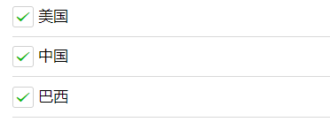
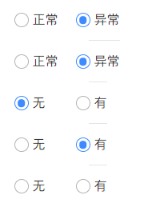

## 生命周期

### 应用的生命周期

| 属性     | 类型     | 必填 | 说明                                   |
| :------- | :------- | :--- | :------------------------------------- |
| onLaunch | function | 否   | 生命周期回调——监听小程序初始化。       |
| onShow   | function | 否   | 生命周期回调——监听小程序启动或切前台。 |
| onHide   | function | 否   | 生命周期回调——监听小程序切后台。       |

```js
App({
  onLaunch: function() { 
    // Do something initial when launch.
  },
  onShow: function() {
      // Do something when show.
  },
  onHide: function() {
      // Do something when hide.
  },
  onError: function(msg) {
    console.log(msg)
  },
  globalData: 'I am global data'
})
```
<!-- more -->


- 用户首次打开小程序，触发 onLaunch（全局只触发一次）。
- 小程序初始化完成后，触发 onShow 方法，监听小程序显示。
- 小程序从前台进入后台，触发 onHide 方法。
- 小程序从后台进入前台显示，触发 onShow 方法。

### 页面生命周期

| 属性              | 类型         | 说明                                                         |
| :---------------- | :----------- | :----------------------------------------------------------- |
| data              | Object       | 页面的初始数据                                               |
| options           | Object       | 页面的组件选项，同 Component` 构造器 中的 `options`          |
| behaviors         | String Array | 类似于mixins和traits的组件间代码复用机制，参见 [behaviors](https://developers.weixin.qq.com/miniprogram/dev/framework/custom-component/behaviors.html) |
| onLoad            | function     | 生命周期回调—监听页面加载                                    |
| onShow            | function     | 生命周期回调—监听页面显示                                    |
| onReady           | function     | 生命周期回调—监听页面初次渲染完成                            |
| onHide            | function     | 生命周期回调—监听页面隐藏                                    |
| onUnload          | function     | 生命周期回调—监听页面卸载                                    |
| onPullDownRefresh | function     | 监听用户下拉动作                                             |
| onReachBottom     | function     | 页面上拉触底事件的处理函数                                   |
| onShareAppMessage | function     | 用户点击右上角转发                                           |
| onShareTimeline   | function     | 用户点击右上角转发到朋友圈                                   |
| onAddToFavorites  | function     | 用户点击右上角收藏                                           |
| onPageScroll      | function     | 页面滚动触发事件的处理函数                                   |
| onResize          | function     | 页面尺寸改变时触发                                           |
| onTabItemTap      | function     | 当前是 tab 页时，点击 tab 时触发                             |
| onSaveExitState   | function     | 页面销毁前保留状态回调                                       |

```js
Page({
  data: {
    text: "This is page data."
  },
  onLoad: function(options) {
    // Do some initialize when page load.
  },
  onShow: function() {
    // Do something when page show.
  },
  onReady: function() {
    // Do something when page ready.
  },
  onHide: function() {
    // Do something when page hide.
  },
  onUnload: function() {
    // Do something when page close.
  },
  onPullDownRefresh: function() {
    // Do something when pull down.
  },
  onReachBottom: function() {
    // Do something when page reach bottom.
  },
  onShareAppMessage: function () {
    // return custom share data when user share.
  },
  onPageScroll: function() {
    // Do something when page scroll
  },
  onResize: function() {
    // Do something when page resize
  },
  onTabItemTap(item) {
    console.log(item.index)
    console.log(item.pagePath)
    console.log(item.text)
  },
  // Event handler.
  viewTap: function() {
    this.setData({
      text: 'Set some data for updating view.'
    }, function() {
      // this is setData callback
    })
  },
  customData: {
    hi: 'MINA'
  }
})
```

总结：
 - onLoad: 页面加载。
    一个页面只会调用一次,参数可以获取wx.navigateTo和wx.redirectTo及<navigator/>中的 query。
 - onShow: 页面显示。
    每次打开页面都会调用一次。
 - onReady: 页面初次渲染完成。
   一个页面只会调用一次，代表页面已经准备妥当，可以和视图层进行交互,对界面的设置如wx.setNavigationBarTitle请在onReady之后设置。
-  onHide: 页面隐藏。
当navigateTo或底部tab切换时调用。
- onUnload: 页面卸载。
当redirectTo或navigateBack的时候调用。

## 页面方式

### 页面栈

| 路由方式   | 页面栈表现                        |
| :--------- | :-------------------------------- |
| 初始化     | 新页面入栈                        |
| 打开新页面 | 新页面入栈                        |
| 页面重定向 | 当前页面出栈，新页面入栈          |
| 页面返回   | 页面不断出栈，直到目标返回页      |
| Tab 切换   | 页面全部出栈，只留下新的 Tab 页面 |
| 重加载     | 页面全部出栈，只留下新的页面      |

### 路由方式

对于路由的触发方式以及页面生命周期函数如下：

| 路由方式   | 触发时机                                                     | 路由前页面 | 路由后页面     |
| :--------- | :----------------------------------------------------------- | :--------- | :------------- |
| 初始化     | 小程序打开的第一个页面                                       |            | onLoad, onShow |
| 打开新页面 | 调用 API wx.navigateTo使用组件 `<navigator open-type="navigateTo"/>` | onHide     | onLoad, onShow |
| 页面重定向 | 调用 API wx.redirectTo 使用组件 `<navigator open-type="redirectTo"/>`                           | onUnload   | onLoad, onShow |
| 页面返回   | 调用 API wx.navigateBack 使用组件`<navigator open-type="navigateBack"/>` 用户按左上角返回按钮     | onUnload   | onShow         |
| Tab 切换   | 调用 API wx.switchTab 使用组件 `<navigator open-type="switchTab"/>` 用户切换 Tab               |            |                |
| 重启动     | 调用 API wx.reLaunch 使用组件 `<navigator open-type="reLaunch"/>`                              | onUnload   | onLoad, onShow |

- `navigateTo`, `redirectTo` 只能打开非 tabBar 页面。
- `switchTab` 只能打开 tabBar 页面。
- `reLaunch` 可以打开任意页面。
- 页面底部的 tabBar 由页面决定，即只要是定义为 tabBar 的页面，底部都有 tabBar。
- 调用页面路由带的参数可以在目标页面的`onLoad`中获取。


## 事件

WXML的冒泡事件列表：

| 类型               | 触发条件                                                     |
| :----------------- | ------------------------------------------------------------ |
| touchstart         | 手指触摸动作开始                                             |
| touchmove          | 手指触摸后移动                                               |
| touchcancel        | 手指触摸动作被打断，如来电提醒，弹窗                         |
| touchend           | 手指触摸动作结束                                             |
| tap                | 手指触摸后马上离开                                           |
| longpress          | 手指触摸后，超过350ms再离开，如果指定了事件回调函数并触发了这个事件，tap事件将不被触发 |
| longtap            | 手指触摸后，超过350ms再离开（推荐使用longpress事件代替）     |
| transitionend      | 会在 WXSS transition 或 wx.createAnimation 动画结束后触发    |
| animationstart     | 会在一个 WXSS animation 动画开始时触发                       |
| animationiteration | 会在一个 WXSS animation 一次迭代结束时触发                   |
| animationend       | 会在一个 WXSS animation 动画完成时触发                       |
| touchforcechange   | 在支持 3D Touch 的 iPhone 设备，重按时会触发                 |

### 绑定并阻止事件冒泡

除 `bind` 外，也可以用 `catch` 来绑定事件。与 `bind` 不同， `catch` 会阻止事件向上冒泡。

例如在下边这个例子中，点击 inner view 会先后调用`handleTap3`和`handleTap2`(因为tap事件会冒泡到 middle view，而 middle view 阻止了 tap 事件冒泡，不再向父节点传递)，点击 middle view 会触发`handleTap2`，点击 outer view 会触发`handleTap1`。

```html
<view id="outer" bindtap="handleTap1">
  outer view
  <view id="middle" catchtap="handleTap2">
    middle view
    <view id="inner" bindtap="handleTap3">
      inner view
    </view>
  </view>
</view>
```

### 互斥事件绑定

自基础库版本 [2.8.2](https://developers.weixin.qq.com/miniprogram/dev/framework/compatibility.html) 起，除 `bind` 和 `catch` 外，还可以使用 `mut-bind` 来绑定事件。一个 `mut-bind` 触发后，如果事件冒泡到其他节点上，其他节点上的 `mut-bind` 绑定函数不会被触发，但 `bind` 绑定函数和 `catch` 绑定函数依旧会被触发。

换而言之，所有 `mut-bind` 是“互斥”的，只会有其中一个绑定函数被触发。同时，它完全不影响 `bind` 和 `catch` 的绑定效果。

例如在下边这个例子中，点击 inner view 会先后调用 `handleTap3` 和 `handleTap2` ，点击 middle view 会调用 `handleTap2` 和 `handleTap1` 。

```html
<view id="outer" mut-bind:tap="handleTap1">
  outer view
  <view id="middle" bindtap="handleTap2">
    middle view
    <view id="inner" mut-bind:tap="handleTap3">
      inner view
    </view>
  </view>
</view>
```

### 事件的捕获阶段

自基础库版本 [1.5.0](https://developers.weixin.qq.com/miniprogram/dev/framework/compatibility.html) 起，触摸类事件支持捕获阶段。捕获阶段位于冒泡阶段之前，且在捕获阶段中，事件到达节点的顺序与冒泡阶段恰好相反。需要在捕获阶段监听事件时，可以采用`capture-bind`、`capture-catch`关键字，后者将中断捕获阶段和取消冒泡阶段。

在下面的代码中，点击 inner view 会先后调用`handleTap2`、`handleTap4`、`handleTap3`、`handleTap1`。

```html
<view id="outer" bind:touchstart="handleTap1" capture-bind:touchstart="handleTap2">
  outer view
  <view id="inner" bind:touchstart="handleTap3" capture-bind:touchstart="handleTap4">
    inner view
  </view>
</view>
```

如果将上面代码中的第一个`capture-bind`改为`capture-catch`，将只触发`handleTap2`。

```html
<view id="outer" bind:touchstart="handleTap1" capture-catch:touchstart="handleTap2">
  outer view
  <view id="inner" bind:touchstart="handleTap3" capture-bind:touchstart="handleTap4">
    inner view
  </view>
</view>
```

### 事件详情见 [链接]([事件 | 微信开放文档 (qq.com)](https://developers.weixin.qq.com/miniprogram/dev/framework/view/wxml/event.html))

## 初写微信小程序

### 去除自带顶部导航栏

 **全部去除app.js**

```json
"window": {
    "navigationStyle": "custom",
}
```

**页面的json文件**

> `"navigationStyle": "custom",`

### 微信小程序换行 br 无效解决方法

在微信小程序中，不识别`<br/>`等标签。
如果文字中想要折行显示，可以使用`\n`替代`<br/>`。
注意：使用`\n`的时候，一定是在`<text>`标签内，如果在`<view>`标签中，`\n`并没有折行左右，只是显示一个空格。

### 路由传参常用方式有以下几种

#### 通过url传参

 

```js
// 产品列表页面
 <navigator url="/pages/detail/detail?productId=12345" hover-class="navigator-hover">详情</navigator>

// 或者
wx.navigateTo({
  url: '/pages/detail/detail?productId=12345'
})
```

```js
// 产品详情页面
Page({
  onLoad: function(option){
    let productId = option.productId;
    console.log(productId);
  }
})
```

上面的方式的参数不能是对象,如果需要传对象,可以将对象转成json字符串,然后拼接到url后面,在接收页面再将json字符串转成对象

```js
let info = {
 a:2,
 b:3
}
let infoStr = JSON.stringfy(info);
wx.navigateTo({
  url: '/pages/detail/detail?infoStr='+infoStr
})
```

```js
// 产品详情页面
Page({
  onLoad: function(option){
    let infoStr = option.infoStr;
    let info = JSON.parse(infoStr);
  }
})
```

#### 通过事件传参

官网例子

```js
// 产品列表页
wx.navigateTo({
  url: url: '/pages/detail/detail'
  events: {
    // 为指定事件添加一个监听器，获取被打开页面传送到当前页面的数据
    acceptDataFromOpenedPage: function(data) {
      console.log(data)
    },
    someEvent: function(data) {
      console.log(data)
    }
    ...
  },
  success: function(res) {
    // 通过eventChannel向被打开页面传送数据
    res.eventChannel.emit('acceptDataFromOpenerPage', { data: 'test' })
  }
})
```

```js
// 产品详情页
Page({
  onLoad: function(option){
    const eventChannel = this.getOpenerEventChannel()
    eventChannel.emit('acceptDataFromOpenedPage', {data: 'test'});
    eventChannel.emit('someEvent', {data: 'test'});
    // 监听acceptDataFromOpenerPage事件，获取上一页面通过eventChannel传送到当前页面的数据
    eventChannel.on('acceptDataFromOpenerPage', function(data) {
      console.log(data)
    })
  }
})
```

简化例子以上例子,在跳转的时候列表页可以向详情页传数据,详情页也可以向列表页传数据,平时我们经常都只是传数据,很少需要回传,以下是简化的例子

```js
// 列表页
wx.navigateTo({
  url: "/pages/home/detail/detail",
  success: function(res) {
    // 通过eventChannel向被打开页面传送数据
    let data = {productId: 'sadf2323',productName:'金龙鱼花生油'};
    res.eventChannel.emit("info", data);
  }
});
```

```js
// 详情页
onLoad: function(options) {
  const eventChannel = this.getOpenerEventChannel();
  // 监听info事件，获取上一页面通过eventChannel传送到当前页面的数据
  eventChannel.on("info", function(data) {
     console.log(data);
  });
},
```

总结: 路由传参可以用这两种方式

1. 通过url拼接参数传输,需要传对象,需要传对象就先讲对象转成json字符串再传
2. 通过eventChannel(事件通道)进行传输(可以传对象)

### getApp() 方法

小程序提供了全局的 getApp() 方法，可获取当前小程序实例，一般用于在子页面中获取顶层应用。

```js
// app.js
App({
  globalData: 1
});
```

```js
// page.js
var app = getApp();
console.log(app.globalData); // 获取 globalData
```

### 缓存

#### 写入

```bash
wx.setStorageSync('password', password);
wx.setStorageSync('mobile', mobile);
```

#### 缓存读取、移除、清除所有

```csharp
var mobile = wx.getStorageSync('mobile');
wx.removeStorageSync('mobile');
wx.clearStorage();
```

### 提示信息和弹框

有icon时最多显示7个字，icon为none时可显示全部信息。

```js
wx.showToast({
  title: '登录成功',
  success: function () {
    setTimeout(function () {
      //要延时执行的代码
     //跳转到成功页面
      wx.switchTab({
        url: '../index/index'
      })
    }, 2000) //延迟时间
  }
})
```

#### wx.showToast一闪而过

显示新增成功后返回上一个界面，但此时基本没显示(一闪而过)直接跳转了。

原因：
wx.showToast只会在当前页面显示，新页面不显示。

解决方法：

```js
 wx.showToast({
 title: '新增成功',
 icon: 'success',
 duration: 1000,
 mask: true,
 success: function() {
 setTimeout(function() {
 //要延时执行的代码
 wx.navigateBack({
 delta: 1
 })
 }, 1000) //延迟时间
 },
 });
```

修改了头像，上传头像的时候使用了wx.showLoading()，结束的时候使用wx.hideLoading()，再用wx.showToast想显示修改成功，但是一闪而过。

原因： wx.hideLoading()会关闭同级中的wx.showLoading 或 wx.showToast

解决方法： 所以要在showToast之前调用wx.hideLoading

### 模态框，确认取消对话框

```js
wx.showModal({
  title: '确认',
  content: '确认提交订单',
    success: function (res) {
      if (res.confirm) {
        console.log('确定')
     }else{
        console.log(取消')
     }
  }
})
```

### 修改单选多选框的样式	

微信小程序原始默认样式如下：



更改后样式：



 

wxss代码：

```css
// radio样式
radio .wx-radio-input {
  width: 30rpx;
  height: 30rpx;
  border: 2rpx solid #b3b3b3;// 外圈边框，未选中状态默认灰色
  border-radius: 50%;
  background: none;
}
//radio选中后内部样式
radio .wx-radio-input.wx-radio-input-checked {
  border: 2rpx solid #15e0a2 !important;// 选中状态外圈边框颜色
  background-color: white !important;// 外圈边框与内圈实心圆间的内容的颜色，默认上边的绿色
}
//radio选中后内部中心
radio .wx-radio-input.wx-radio-input-checked::before {
  width: 60%;
  height: 60%;
  background: #15e0a2;// 内圈实心圆选中颜色
  border-radius: 50%;
  content: '';// 隐藏✔️
  transform: translate(-50%, -50%) scale(1);
  -webkit-transform: translate(-50%, -50%) scale(1);
}
//checkbox 选项框大小  
checkbox .wx-checkbox-input {
  width: 30rpx;
  height: 30rpx;
}
//checkbox选中后样式  
checkbox .wx-checkbox-input.wx-checkbox-input-checked {
  background: #15e0a2;
  border: 1rpx solid #15e0a2 !important; //选中后多选框边框颜色
}
//checkbox选中后图标样式  
checkbox .wx-checkbox-input.wx-checkbox-input-checked::before {
  width: 28rpx;
  height: 28rpx;
  line-height: 28rpx;
  text-align: center;
  font-size: 22rpx;
  color: #fff;
  background: transparent;
  transform: translate(-50%, -50%) scale(1);
  -webkit-transform: translate(-50%, -50%) scale(1);
}
```

### 单选多选框点击时有灰色背景色

`.weui-check__label {background-color: rgba(0, 0, 0, 0) !important;}`

### 小程序checkbox调整大小

`.cb{  transform: scale(0.6,0.6); }`

**多选单勋框如果点击是上下抖动可能是因为高度原因**

### 微信小程序\文本框\失去\对焦触发\事件

bindinput：输入一个字节一触发
bindblur：离开文本框时出发

### 返回上一个页面

```js
goBack(){
    wx.navigateBack({
      delta: 1  
    })
  },
```

